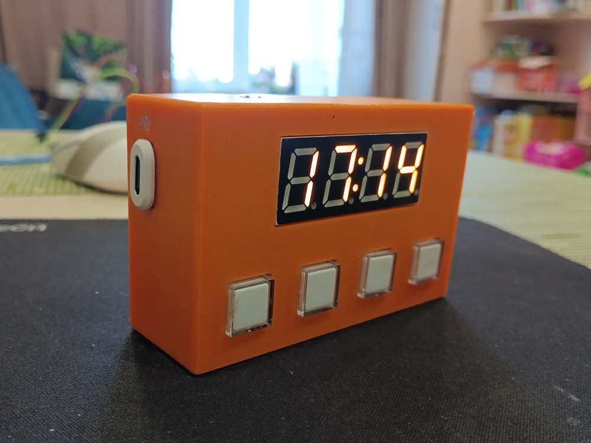
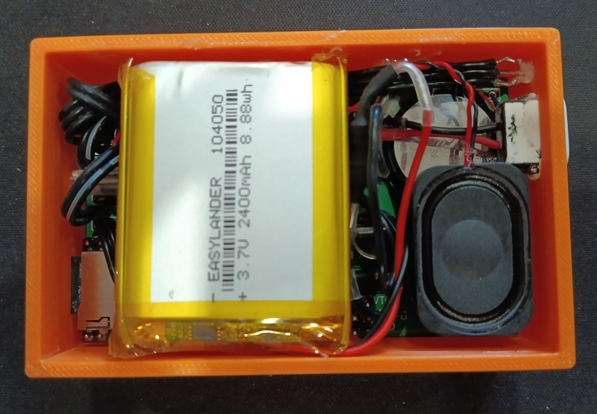
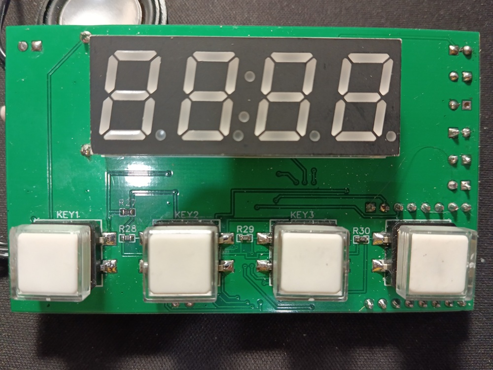
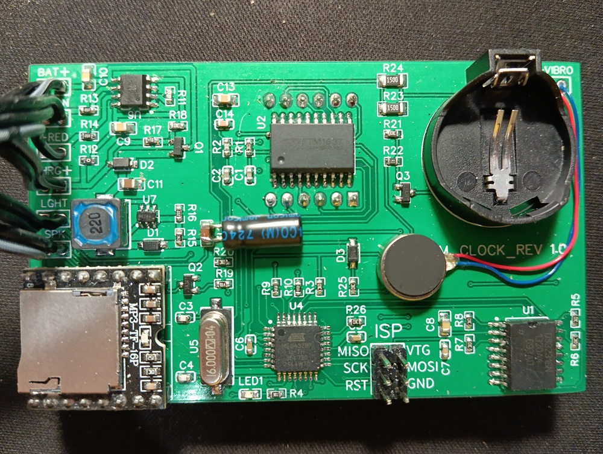
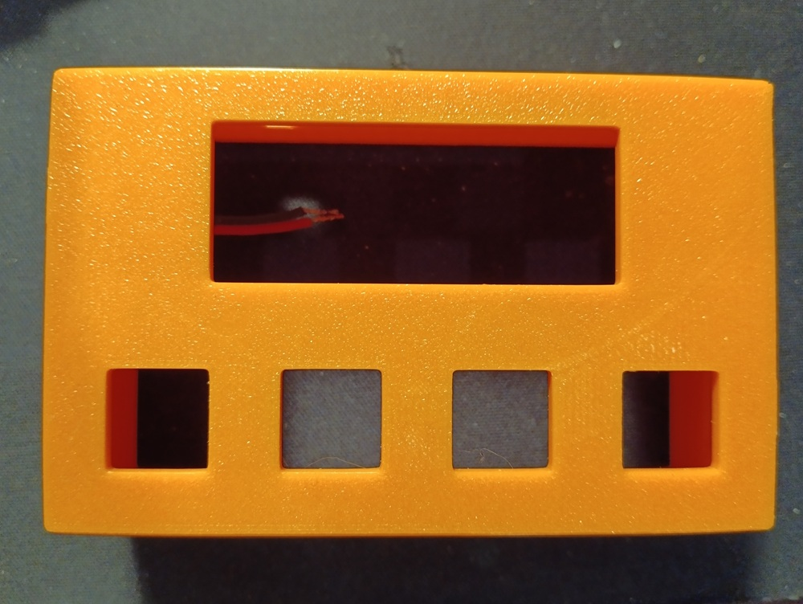
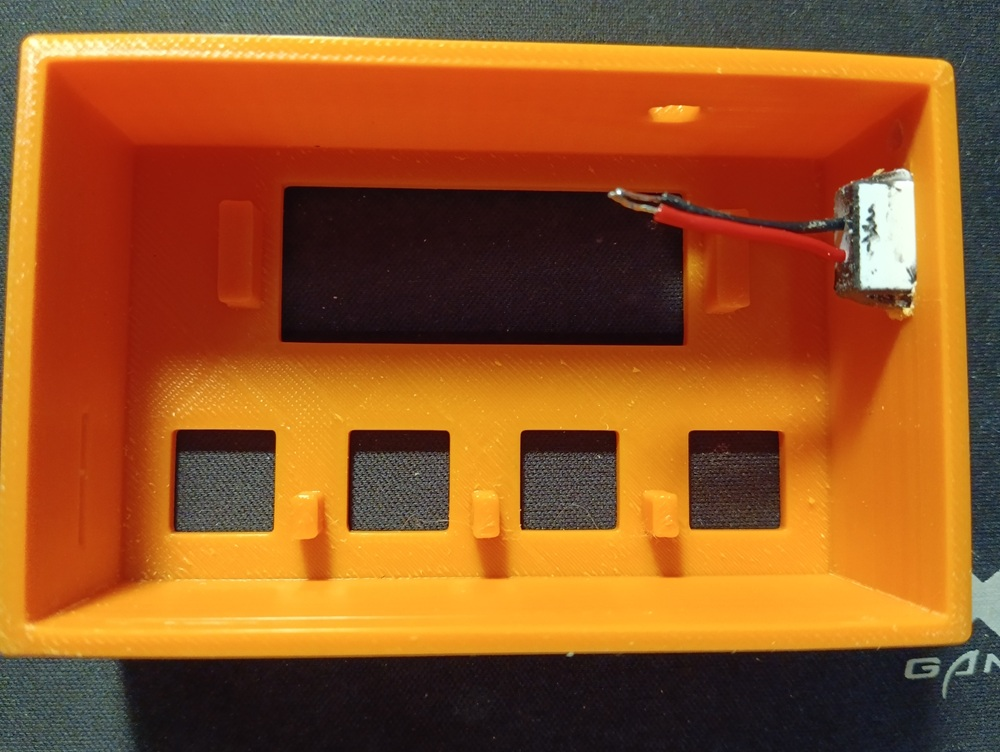
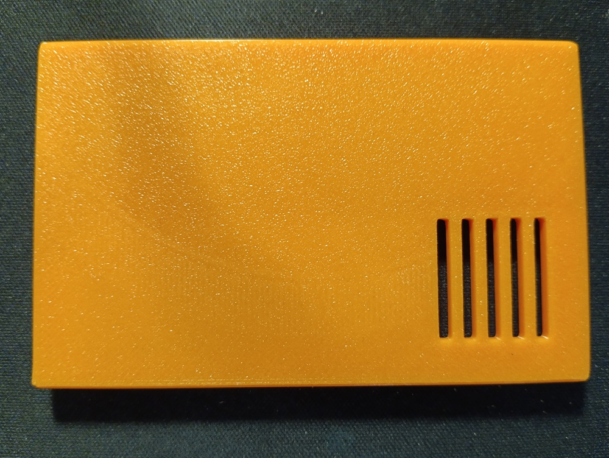
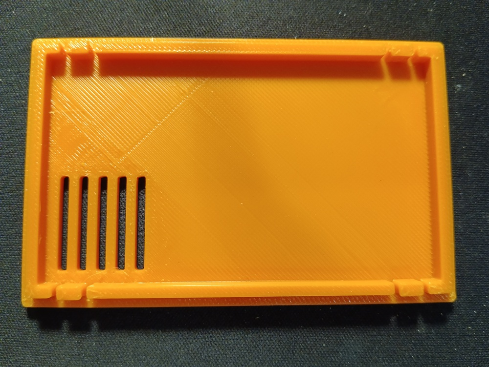

# Умные часы с будильником 

### Зачем это надо? 
В современном мире человек очень сильно привязан к смартфону. Зачастую люди засыпают вместе со своим смартфоном и просыпаются тоже с ним. Что-бы отучить себя от этой вредной привычки сделал умные часы-будильник.

### 🖥️ ПО использованное при создании проекта
В проекте использовал следующее ПО:
- для проектирования печатной платы `EasyEDA`
- для проектирования корпуса `FreeCAD`
- для программирования `VSCode`

## 📌 Основные компоненты
- **Отображение времени**: Модуль `TM1637` с 4-разрядным семисегментным индикатором.
- **Часы реального времени (RTC)**: Точное время обеспечивает модуль `DS3231`. Модуль питается от батарейки `CR2032`.
- **Будильник**:
  - Воспроизведение музыки через `DFPlayer Mini` (MP3-плеер).
  - Вибрационный сигнал через моторчик.
  - Настройка времени срабатывания, громкости и включения/выключения.
- **Датчики**:
  - Освещения (регулировка яркости индикатора).
  - Напряжения батареи (контроль заряда).
- **Управление**:
  - 4 кнопки для настройки времени, будильника и других функций.
  - Меню для изменения параметров.

## 🚀 Ключевые функции
### ⏰ Часы
- Отображение текущего времени.
- Возможность отключения экрана для экономии энергии.

### 🔔 Будильник
- Срабатывает в заданное время.
- Воспроизводит случайную мелодию из 8 доступных.
- Через 30 секунд добавляется вибрация.
- Остановка по кнопке или через 60 секунд.

### 🎵 Плеер
- Воспроизведение музыки с карты памяти с регулировкой громкости.

### 🔦 Фонарик
- Фонарик (включение/выключение светодиода при нажатии кнопки 2).

### ⚙️ Настройки
- Установка текущего времени.
- Включение/выключение будильника.
- Настройка времени и громкости будильника.

### 🔋 Энергосбережение
- Контроль напряжения батареи с предупреждением о разряде.
- Автоматическая регулировка яркости экрана.
- Зарядка через порт `USB type C`.

### 👋 Приветствие
- При включении на экране отображается `HELLO SErGEi`.

## 🌟 Особенности
- Данные будильника (время, громкость, статус) сохраняются в `EEPROM`.
- Антидребезг кнопок.
- Задержки и таймеры для стабильной работы.

## 🛠️ Проектные файлы
### 🖨️ 3D модели корпуса
- [3d модель для FreeCAD](./free_cad/enclosure.FCStd)
- [Основной корпус](./free_cad/box.stl)
- [Крышка](./free_cad/lid.stl)

### 🎛️ Файлы печатной платы
- [Схема принципиальная](./easy_eda/Alarm_clock.json)
- [Разводка платы](./easy_eda/PCB_Alarm_clock.json)

## 📸 Фотографии проекта
   
   
   
 
   
   
   
   

> Все файлы доступны в репозитории проекта. Для 3D печати рекомендуется использовать ABS пластик. Для загрузки скетча в микроконтроллер используется внутрисхемное программирвание. 