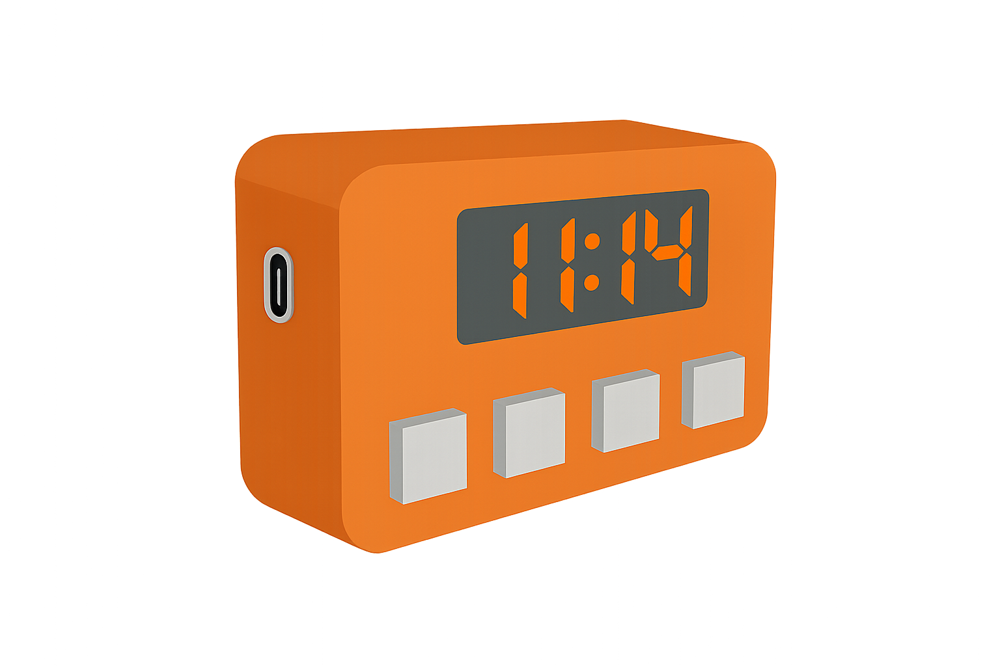
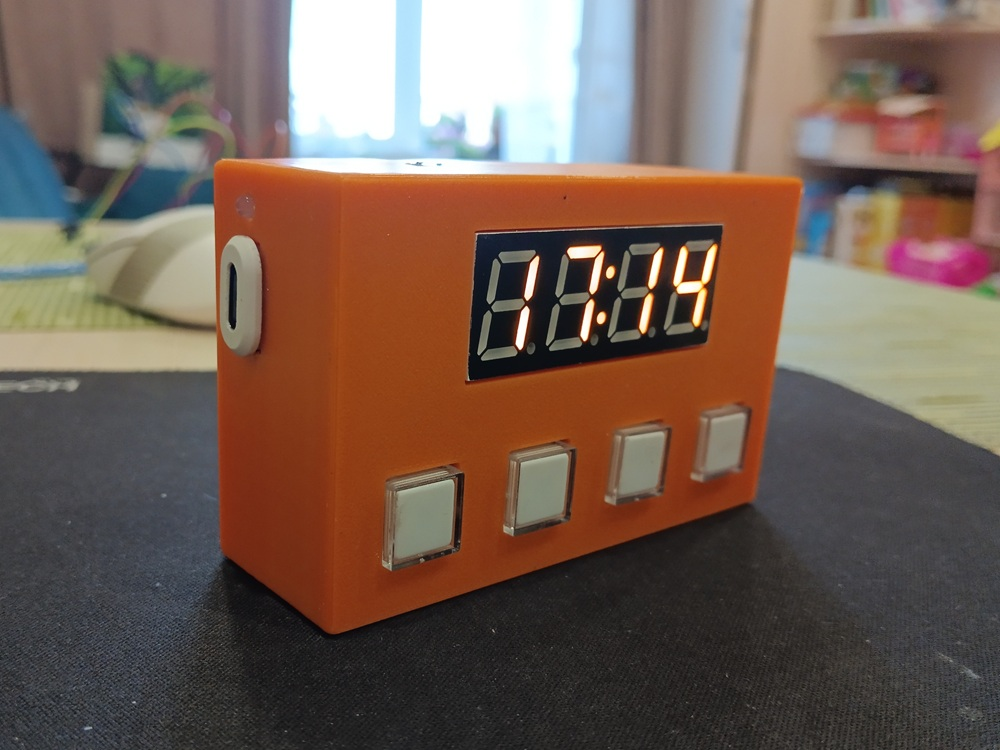
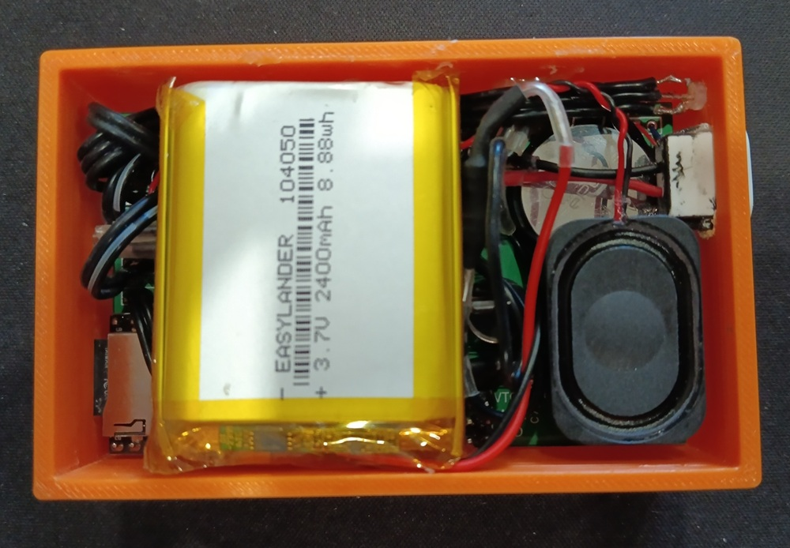
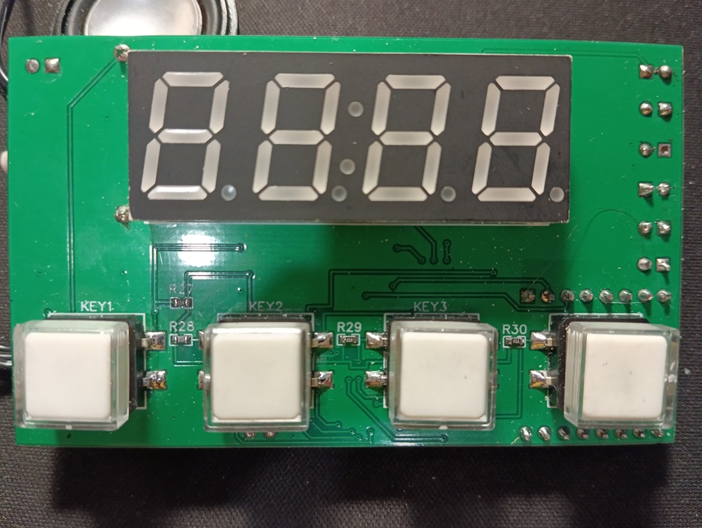
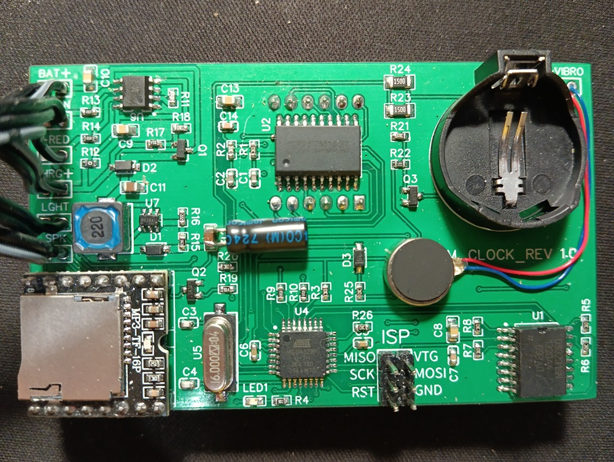
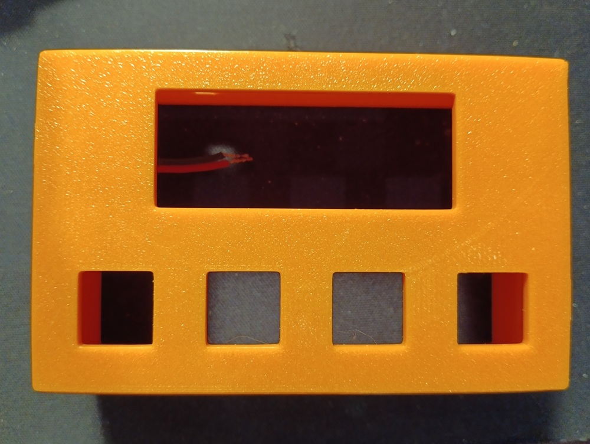
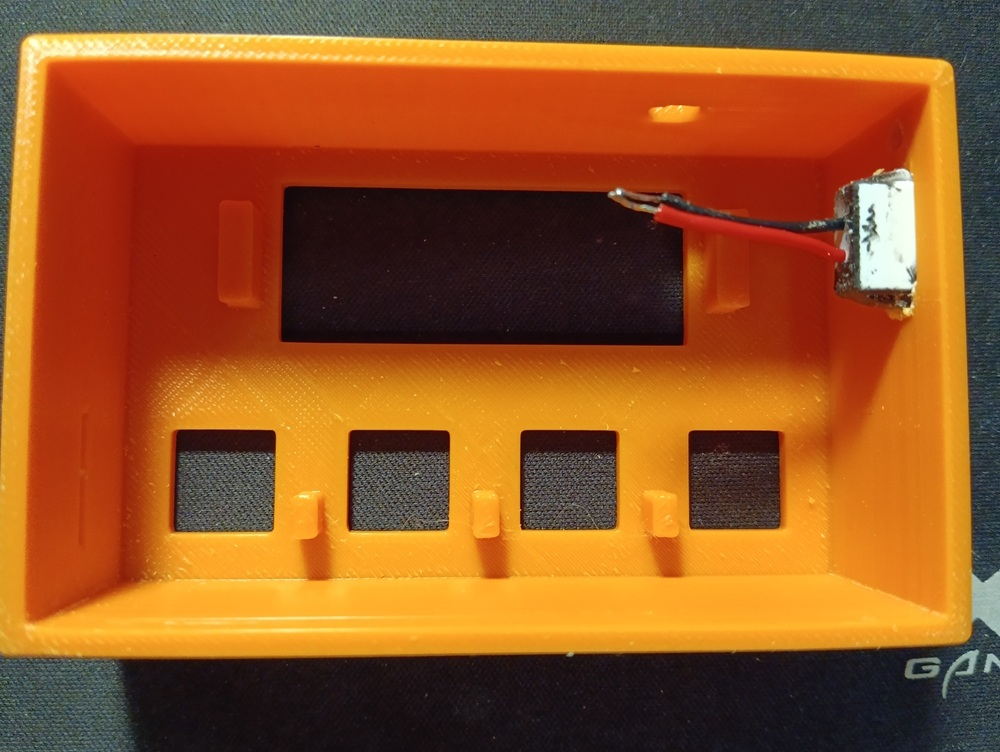
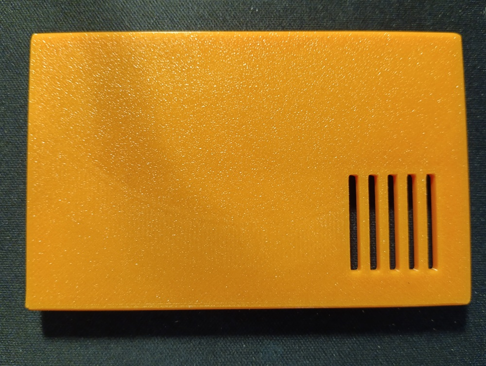
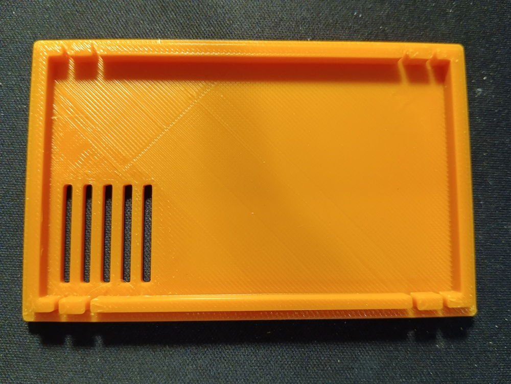

<h1 align="center"> Часы-будильник</h1>

  

  

## Описание проекта

Данный проект представляет собой автономный **умный будильник** на базе **Atmega328P-AU**, оснащённый модулем реального времени **DS3231**, MP3‑плеером **DFPlayer Mini**, семисегментным индикатором **TM1637**, вибромотором и системой энергосбережения. Устройство рассчитано на работу от аккумулятора и может использоваться как настольный или переносной будильник.

Проект ориентирован на низкое энергопотребление, удобное управление кнопками и расширенный функционал: музыка, вибрация, отложенный сигнал, индикация напряжения батареи и автоматическая регулировка яркости.

## ПО использованное при создании проекта
В проекте использовал следующее ПО:
- проектирование печатной платы `EasyEDA`
- проектирование корпуса `FreeCAD`
- написание кода `VSCode`, язык `Arduino C`
---

## Основные возможности

* Отображение текущего времени (RTC DS3231)
* Отображение даты и температуры
* Настраиваемый будильник
* Режим «Вздремнуть» (откладывание будильника)
* Таймер обратного отсчёта
* Звуковой сигнал (MP3) + вибрация
* Проигрывание музыки
* Регулировка громкости
* Автоматическая регулировка яркости по датчику освещённости
* Контроль напряжения аккумулятора
* Индикация разряда батареи
* Режим глубокого сна для экономии энергии
* Встроенный фонарик (LED)

---

## Аппаратная часть

### Основные компоненты

* **ATmega328P-AU** - микроконтроллер
* **RTC DS3231** — модуль реального времени
* **TM1637** — 4‑разрядный семисегментный индикатор
* **DFPlayer Mini** — MP3‑плеер для сигнала будильника и музыки
* **Вибромотор**
* **Светодиод** — режим фонарика
* **Фоторезистор** — датчик освещённости
* **Кнопки управления (4 шт.)**
* **Li‑Ion / Li‑Po аккумулятор**

### Питание и зарядка

Питание устройства осуществляется от аккумулятора.

*  Используется модуль **TP4056**
* Зарядка через разъём **USB Type‑C**
* Возможность одновременной зарядки и работы устройства

---

## Управление кнопками

| Кнопка | Действие                                              |
| ------ | ----------------------------------------------------- |
| BTN1   | Вход / выход из меню, остановка будильника, выход из режима сна
| BTN2   | Показ температуры и даты. Подтверждение, сон (долгое нажатие)              
| BTN3   | Показ напряжения, отложить сигнал, уменьшение значений |
| BTN4   | Фонарик, отложить сигнал, увеличение значений          |

---

## Меню

Меню вызывается коротким нажатием **BTN1**:

* **CLO** — установка времени
* **ALr** — включение / настройка будильника
* **LOUd** — установка громкости будильника
* **PLAY** — режим музыкального плеера
* **Chro** — таймер обратного отсчёта

Навигация осуществляется кнопкой **BTN4**, подтверждение — **BTN2**.

---

## Энергосбережение

* Отключение неиспользуемых периферийных модулей MCU
* Глубокий сон (**POWERDOWN_SLEEP**)
* Пробуждение по кнопке или сигналу RTC 

---

## Используемые библиотеки

* `RTClib`
* `DFPlayerMini_Fast`
* `GyverTM1637`
* `GyverPower`
* `EncButton`
* `EEPROM`

---

## Примечания

* Перед использованием рекомендуется откалибровать измерение напряжения батареи (см. комментарии в функции `voltageMeasure()`)
* Для установки времени с компьютера необходимо раскомментировать строку установки RTC в `setup()`
* Инструкцию по загрузке mp3 файлов на карту памяти см. в [/mp3/README.md](./mp3/README.md)

---

## Проектные файлы
### 3D модели корпуса
- [3d модель для FreeCAD](./free_cad/enclosure.FCStd)
- [Основной корпус](./free_cad/box.stl)
- [Крышка](./free_cad/lid.stl)

### Файлы печатной платы
- [Схема принципиальная](./easy_eda/Alarm_clock.json)
- [Разводка платы](./easy_eda/PCB_Alarm_clock.json)

## Фотографии проекта
   
   
   
 
   
   
   
   

> Все файлы доступны в репозитории проекта. Для 3D печати рекомендуется использовать ABS пластик. Для загрузки скетча в микроконтроллер используется внутрисхемное программирвание. 

## Лицензия

Проект распространяется свободно и может быть использован, изменён и дополнен в учебных и личных целях.